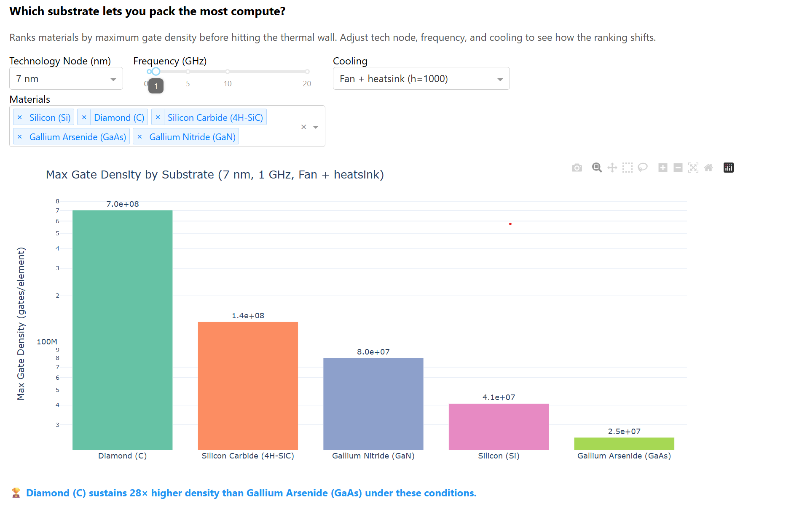

# Aethermor

[](https://github.com/Yoder23/aethermor/actions/workflows/ci.yml)

[](LICENSE)
[](https://github.com/Yoder23/aethermor/releases)

**Open-source Python toolkit for chip thermal analysis, cooling tradeoffs, and compute-density limits in advanced hardware systems.**

---

As transistor scaling slows, **thermal constraints are becoming the primary
bottleneck in computing**. Aethermor provides the tools to model, analyze, and
design around those constraints — interactively or programmatically.

### What you can do with Aethermor

- **Find compute-density limits** — how many gates can a substrate actually sustain before thermal runaway?
- **Explore cooling tradeoffs** — at what point does better cooling stop helping?
- **Compare chip architectures** — CMOS vs. adiabatic vs. reversible logic under real thermal constraints
- **Locate thermal bottlenecks** — per-block headroom analysis on heterogeneous SoCs
- **Project technology scaling** — energy and thermal wall from 130 nm down to 1.4 nm
- **Test your own materials** — plug in custom substrates, paradigms, and cooling layers

All models use real physics in SI units, validated against CODATA 2018, the CRC
Handbook, ITRS/IRDS roadmaps, published specifications for real chips
(NVIDIA A100, Apple M1, AMD EPYC, Intel i9-13900K), and published hardware
measurements (JEDEC θ_jc thermal resistance, IR thermal imaging, HotSpot
benchmarks). **Scope: Production-stable for architecture-stage thermal exploration and inverse design; not intended for sign-off, transient package verification, or transistor-level thermal closure.**
See [LIMITATIONS.md](LIMITATIONS.md) for scope and validation status.

---

## Case Study: The Cooling Upgrade That Wouldn't Help

> *Full writeup: [docs/CASE_STUDY.md](docs/CASE_STUDY.md) · Run it: `python benchmarks/case_study_cooling_decision.py`*

A team designing a 5 nm AI accelerator is considering a **$2M data center
retrofit** to upgrade from air cooling to direct liquid cooling. Their
assumption: 20× more aggressive cooling should unlock significantly more
compute density.

**Aethermor shows this assumption is wrong — in 10 seconds.**

| Strategy | Density Gain | Cost |
|----------|-------------|------|
| Upgrade to liquid cooling (20× more aggressive) | **0.3%** | $2M retrofit |
| Switch to SiC substrate (same air cooling) | **232%** | Per-die premium |
| Redistribute compute across SoC blocks | **47% throughput** | **Free** |

The reason: silicon's conduction floor — an irreducible thermal resistance
set by the substrate's thermal conductivity — means heat can't leave the die
interior fast enough regardless of how well you cool the surface. Switching
substrate is 780× more effective than upgrading cooling. And redistributing
compute from the thermally-limited GPU block to the underutilized L3 cache
(26× thermal headroom) gives 47% more throughput with zero hardware changes.

**This is the type of non-obvious, decision-changing insight** that
architecture-stage thermal exploration surfaces — and the reason Aethermor
exists.

---

## Quick Start

```bash
git clone https://github.com/Yoder23/aethermor.git
cd aethermor
pip install -e ".[dashboard]"      # core + interactive UI
python app.py                      # open http://127.0.0.1:8050
```

Or install directly from the release wheel:

```bash
pip install https://github.com/Yoder23/aethermor/releases/download/v1.0.0/aethermor-1.0.0-py3-none-any.whl
```

> **Core only** (no UI): `pip install -e .`
> **Everything** (dev + UI): `pip install -e ".[all]"`

---

## Interactive Explorer Dashboard

```bash
python app.py
```

The built-in dashboard lets you interactively explore thermal design spaces
with live-updating charts. Every parameter is a slider or dropdown:

| Tab | What You Can Do |
|-----|-----------------|
| **Material Ranking** | Pick a tech node, frequency, and cooling — see which substrate lets you pack the most compute |
| **Cooling Analysis** | Set a material and gate density — see temperature vs. cooling with the conduction floor |
| **Paradigm Comparison** | Drag the frequency slider to watch the CMOS ↔ adiabatic crossover shift in real time |
| **Technology Roadmap** | Energy per gate and Landauer gap from 130 nm down to 1.4 nm |
| **SoC Thermal Map** | Thermal headroom per block on a heterogeneous CPU+GPU+cache+IO chip — find the bottleneck |
| **Custom Material** | Define your own substrate by entering its thermal properties — it instantly appears in every other tab |



*The Material Ranking tab comparing maximum compute density across five
substrates at the 7 nm node and 1 GHz. Diamond sustains 28× higher gate
density than GaAs under the same thermal and cooling constraints.*

---

## Python API

Every capability in the dashboard is also available as a Python function.

### Find the maximum compute density for a substrate

```python
from analysis.thermal_optimizer import ThermalOptimizer

opt = ThermalOptimizer(tech_node_nm=7, frequency_Hz=1e9)

ranking = opt.material_ranking(h_conv=1000.0)
for r in ranking:
    print(f"{r['material_name']:<25s}  {r['max_density']:.2e} gates/elem")
```

### Find minimum cooling requirements

```python
req = opt.find_min_cooling("silicon", gate_density=1e5)
print(f"Min h_conv: {req['min_h_conv']:.0f} W/(m²·K)  →  {req['cooling_category']}")
```

### Locate thermal bottlenecks on a heterogeneous SoC

```python
from physics.chip_floorplan import ChipFloorplan

soc = ChipFloorplan.modern_soc()
headroom = opt.thermal_headroom_map(soc, h_conv=1000.0)
for block in headroom:
    print(f"{block['name']:<20s}  T={block['T_max_K']:.0f} K  headroom={block['density_headroom_factor']:.1f}×")
```

### Compare CMOS vs. adiabatic logic crossover

```python
from physics.energy_models import CMOSGateEnergy, AdiabaticGateEnergy

cmos = CMOSGateEnergy(tech_node_nm=7)
adiabatic = AdiabaticGateEnergy(tech_node_nm=7)
f_cross = adiabatic.crossover_frequency(cmos)
print(f"Adiabatic beats CMOS below {f_cross:.2e} Hz")
```

### Project technology scaling from 130 nm to 1.4 nm

```python
from analysis.tech_roadmap import TechnologyRoadmap

roadmap = TechnologyRoadmap()
print(roadmap.full_report())
```

### Model a realistic cooling stack

```python
from physics.cooling import CoolingStack

stack = CoolingStack.liquid_cooled()
h_eff = stack.effective_h(die_area_m2=100e-6)
print(f"Effective h = {h_eff:.0f} W/(m²·K)")
print(f"Max power   = {stack.max_power_W(100e-6):.1f} W")
```

### Add custom materials, paradigms, and cooling layers

Aethermor is **fully extensible**. Register custom materials, computing paradigms,
and cooling layers — they instantly work everywhere: optimizer, UI, chip floorplan.

```python
from physics.materials import registry, Material

# Register a custom substrate
registry.register("hex_bn", Material(
    name="Hexagonal Boron Nitride (h-BN)",
    thermal_conductivity=600.0,  # W/(m·K)
    specific_heat=800.0,         # J/(kg·K)
    density=2100.0,              # kg/m³
    electrical_resistivity=1e15, # Ω·m
    max_operating_temp=1273.15,  # K
    bandgap_eV=6.0,
    notes="2D insulator with excellent thermal interface properties."
))

# Now use it everywhere — optimizer, UI, chip floorplan:
ranking = opt.material_ranking(h_conv=1000, materials=["silicon", "hex_bn"])
```

### Register a custom computing paradigm

```python
from dataclasses import dataclass
from physics.energy_models import paradigm_registry
from physics.constants import landauer_limit

@dataclass
class SpintronicGateEnergy:
    tech_node_nm: float = 7.0
    spin_current_A: float = 50e-6
    switching_time_s: float = 2e-9
    resistance_ohm: float = 5e3

    def energy_per_switch(self, frequency=1e9, T=300.0):
        return self.spin_current_A**2 * self.resistance_ohm * self.switching_time_s

    def landauer_gap(self, T=300.0, frequency=1e9):
        return self.energy_per_switch(frequency, T) / landauer_limit(T)

paradigm_registry.register("spintronic", SpintronicGateEnergy)
# Now use paradigm="spintronic" in any FunctionalBlock
```

### Save and share configurations

```python
registry.save_json("my_materials.json")   # Share with collaborators
registry.load_json("colleague_mats.json") # Load theirs
```

See [`examples/custom_material.py`](examples/custom_material.py) for a full
walkthrough of all extensibility features.

---

## Examples

Seven ready-to-run scripts that each answer a specific research question:

```bash
python examples/optimal_density.py       # Thermal wall per substrate
python examples/adiabatic_crossover.py   # Paradigm crossover points
python examples/material_comparison.py   # Substrate comparison
python examples/heterogeneous_soc.py     # SoC hotspot analysis
python examples/technology_roadmap.py    # 130 nm → 1.4 nm projections
python examples/thermal_optimizer.py     # Inverse design: headroom + power redistribution
python examples/custom_material.py       # Register your own material, paradigm, and cooling layer
```

## Tests

```bash
python -m pytest tests/ -v              # ~278 tests, ~2 minutes
python -m validation.validate_all       # 133 physics cross-checks, ~13 seconds
python run_all_validations.py           # ALL 12 suites, 680+ checks, ~3 minutes
```

## Benchmarks

Reproducible comparison and case-study scripts in [`benchmarks/`](benchmarks/):

| Script | What It Shows |
|--------|---------------|
| `hotspot_comparison.py` | Fair 6-test comparison against HotSpot — where each tool wins |
| `chip_thermal_database.py` | **82 checks** against 12 real chips across 4 segments (accelerators, servers, desktops, mobile) |
| `material_cross_validation.py` | **93 checks** cross-validating 9 materials against CRC, ASM, NIST, Ioffe, manufacturer data |
| `real_world_validation.py` | 33 checks against 4 published chip designs (A100, M1, EPYC, i9) |
| `experimental_validation.py` | 18 checks vs JEDEC θ_jc, IR thermal imaging, HotSpot benchmarks |
| `literature_validation.py` | 20 cross-checks against CODATA, CRC, ITRS, Incropera & DeWitt |
| `case_study_datacenter.py` | **Decision-changing**: 8× GPU node cooling strategy — liquid vs substrate vs diamond |
| `case_study_mobile_soc.py` | Mobile SoC thermal envelope — sustainable power, substrate impact, CMOS vs adiabatic |
| `case_study_cooling_decision.py` | Cooling vs substrate vs compute redistribution |
| `case_study_substrate_selection.py` | Substrate selection workflow: 4 questions answered in ~9 seconds |
| `case_study_soc_bottleneck.py` | SoC bottleneck identification and power reallocation |

```bash
python run_all_validations.py                    # Run everything (12 suites)
python benchmarks/chip_thermal_database.py       # 82 checks, 12 real chips
python benchmarks/material_cross_validation.py   # 93 checks, 9 materials
python benchmarks/real_world_validation.py       # 33 real-chip validations
python benchmarks/experimental_validation.py     # 18 experimental measurement checks
python benchmarks/literature_validation.py       # 20 literature cross-checks
python benchmarks/case_study_datacenter.py       # Datacenter cooling strategy
python benchmarks/case_study_mobile_soc.py       # Mobile SoC thermal envelope
```

---

## Who This Is For

Aethermor is for **architecture-stage thermal engineering** — the
stage where you decide *what* to build before committing to detailed design.

- **Chip architects** deciding between substrates, cooling strategies, and density targets
- **Computer architecture researchers** exploring density vs. thermal tradeoffs across paradigms
- **Thermal engineers** evaluating cooling stack options and identifying diminishing returns
- **Anyone studying the physical limits of computation** — Landauer limit, adiabatic switching, technology scaling

Aethermor tells you *which* detailed designs are worth simulating — and
which assumptions to challenge before committing silicon.

## What's Inside

### `physics/` — Chip Thermal and Energy Models (SI Units)

| Module | What It Does |
|--------|-------------|
| `constants.py` | Boltzmann k_B, Planck h, Landauer limit (CODATA 2018) |
| `materials.py` | 9 substrates + custom material registry with validation, JSON import/export |
| `energy_models.py` | 4 paradigms + custom paradigm registry with EnergyModel protocol |
| `thermal.py` | 3D Fourier heat diffusion with CFL-stable timestep, 0.00% energy conservation error |
| `cooling.py` | Multi-layer cooling stacks + custom layer registry with JSON serialization |
| `chip_floorplan.py` | Heterogeneous SoC: CPU/GPU/cache/IO blocks with per-block paradigms |

### `analysis/` — Inverse Design & Thermal Optimization

| Module | What It Does |
|--------|-------------|
| `thermal_optimizer.py` | 8 inverse design tools: max density, min cooling, material ranking, headroom map, power redistribution |
| `tech_roadmap.py` | Node projections (130 nm → 1.4 nm): energy, Landauer gap, paradigm crossover |
| `design_space.py` | Multi-dimensional parameter sweeps with Pareto extraction |
| `regime_map.py` | 5-regime classification: deep_classical → near_limit |
| `landauer_gap.py` | Distance-from-Landauer analysis |
| `thermal_map.py` | Hotspot detection, cooling efficiency maps |

### Project Layout

```
app.py                # Interactive Explorer UI — run this
physics/              # SI-unit thermodynamic models (extensible registries)
analysis/             # Inverse design & research tools
simulation/           # Monte Carlo / evolutionary simulation engine
validation/           # 133 physics cross-checks
benchmarks/           # 11 validation/case-study scripts (246+ checks)
examples/             # 7 ready-to-run research scripts
experiments/          # Reproducibility scripts (ablations, scaling, fault sweeps)
tests/                # 278 unit, integration, regression tests
scripts/              # Release, benchmarking, and maintenance utilities
run_all_validations.py  # Master runner: all 12 suites, 680+ checks
```

---

## Scientific Grounding & Validation

Aethermor is built on established heat transfer and semiconductor physics.
Every model is cross-validated against published reference data:

| Check | Result |
|-------|--------|
| Unit + integration tests | 278 pass, 0 fail |
| Physics validation | 133 cross-checks vs CODATA 2018, CRC Handbook, ITRS/IRDS | 
| Chip thermal database | 82 checks across 12 real chips in 4 segments (A100, H100, MI300X, EPYC, Xeon, i9, Ryzen, M1, M2, Snapdragon, etc.) |
| Material cross-validation | 93 checks, 9 materials vs CRC Handbook, ASM, NIST, Ioffe, manufacturer data |
| Real-world chip validation | 33 checks across 4 published chip designs (all pass) |
| Experimental measurement validation | 18 checks vs JEDEC θ_jc, IR thermal imaging, HotSpot (all pass) |
| Literature validation | 20 cross-checks vs published reference data (all pass) |
| Engineering case studies | 23+ decision-driven checks (datacenter cooling, mobile SoC, substrate selection) |
| Energy conservation | 0.00% error in 3D Fourier solver |
| Reproducibility | Seeded, deterministic |
| **Total validated checks** | **680+** |

Run `python run_all_validations.py` to verify everything in one command (12 suites, ~3 minutes).

See [VALIDATION.md](VALIDATION.md) for methodology and reference sources.

## Scope and Limitations

Aethermor operates at the **thermal and energy level** — not transistor or
circuit level. Models use published material properties and standard physics
(Fourier's law, CMOS scaling, Landauer's principle). The toolkit has been
validated with 680+ independent checks against:

- **12 real production chips** across accelerators, servers, desktops, and mobile
- **9 materials** cross-validated against CRC Handbook, ASM, NIST, and Ioffe Institute
- Published JEDEC-standard thermal resistance measurements and IR thermal imaging data
- HotSpot simulation benchmarks

**Scope: Production-stable for architecture-stage thermal exploration and inverse design; not intended for sign-off, transient package verification, or transistor-level thermal closure.**
Detailed die-level correlation with proprietary floorplan data is a
planned next step.

See [LIMITATIONS.md](LIMITATIONS.md) for the full discussion.

## Documentation

### Getting Started

| Document | What It Covers |
|----------|---------------|
| [docs/INSTALL_VERIFY.md](docs/INSTALL_VERIFY.md) | Install, verify, smoke test, troubleshooting |
| [docs/API_REFERENCE.md](docs/API_REFERENCE.md) | Complete API reference — all classes, methods, parameters |
| [docs/SAFE_USE.md](docs/SAFE_USE.md) | Safe / caution / not-for use-case tables |

### Engineering Case Studies

| Document | What It Covers |
|----------|---------------|
| [docs/CASE_STUDY.md](docs/CASE_STUDY.md) | Cooling vs substrate vs compute redistribution |
| [docs/CASE_STUDY_SOC.md](docs/CASE_STUDY_SOC.md) | SoC bottleneck reallocation (47% throughput for free) |
| [docs/CASE_STUDY_PARADIGM.md](docs/CASE_STUDY_PARADIGM.md) | Material + paradigm selection (SiC 232%, diamond 1387%) |

### Validation & Rigor

| Document | What It Covers |
|----------|---------------|
| [VALIDATION.md](VALIDATION.md) | Physics validation methodology & references |
| [LIMITATIONS.md](LIMITATIONS.md) | Scope, simplifications, path to hardware validation |
| [HONEST_REVIEW.md](HONEST_REVIEW.md) | Self-audit with grades and competitive comparison |
| [docs/ACCURACY.md](docs/ACCURACY.md) | Error metrics, benchmark corpus, operating envelope |
| [docs/EXTERNAL_VALIDATION.md](docs/EXTERNAL_VALIDATION.md) | External correlation and pilot user results |
| [docs/REPRODUCIBILITY.md](docs/REPRODUCIBILITY.md) | Seed policy, tolerance policy, gold outputs |
| [docs/benchmark_protocol.md](docs/benchmark_protocol.md) | Benchmark suite classification and release-gate thresholds |

### Project Governance

| Document | What It Covers |
|----------|---------------|
| [CHANGELOG.md](CHANGELOG.md) | Version history |
| [RELEASE_NOTES_v1.0.0.md](RELEASE_NOTES_v1.0.0.md) | v1.0.0 release details |
| [docs/SEMVER.md](docs/SEMVER.md) | Semantic versioning policy |
| [docs/SUPPORT_POLICY.md](docs/SUPPORT_POLICY.md) | Version support, response expectations, deprecation |

## Contributing

Contributions welcome — especially new materials, computing paradigms,
thermal models, or analysis tools. The registry architecture makes it
easy to add new components without touching core code:

- **New material?** → `registry.register("my_mat", Material(...))` 
- **New paradigm?** → `paradigm_registry.register("my_idea", MyModelClass)`
- **New cooling layer?** → `cooling_registry.register("my_tim", ThermalLayer(...))`

See [CONTRIBUTING.md](CONTRIBUTING.md), [CODE_OF_CONDUCT.md](CODE_OF_CONDUCT.md),
and [SECURITY.md](SECURITY.md).

## License

Apache License 2.0. See [LICENSE](LICENSE).
